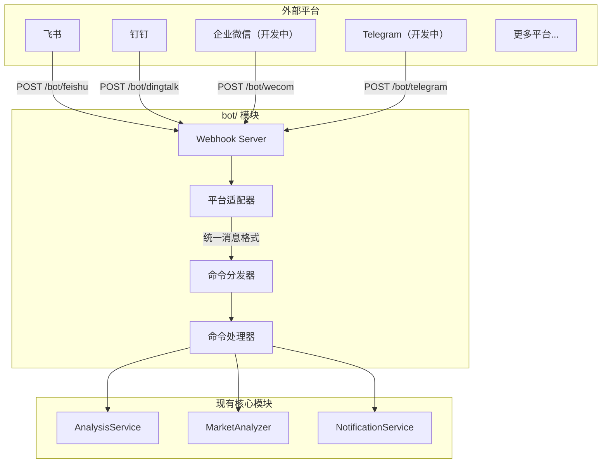

## 一、整体设计




## 二、目录结构

在项目根目录新建 `bot/` 目录：

```
bot/
├── __init__.py             # 模块入口，导出主要类
├── models.py               # 统一的消息/响应模型
├── dispatcher.py           # 命令分发器（核心）
├── commands/               # 命令处理器
│   ├── __init__.py
│   ├── base.py             # 命令抽象基类
│   ├── analyze.py          # /analyze 股票/指数分析
│   ├── market.py           # /market 大盘复盘
│   ├── help.py             # /help 帮助信息
│   └── status.py           # /status 系统状态
└── platforms/              # 平台适配器
    ├── __init__.py
    ├── base.py             # 平台抽象基类
    ├── feishu.py           # 飞书机器人
    ├── dingtalk.py         # 钉钉机器人
    ├── dingtalk_stream.py  # 钉钉机器人Stream
    ├── wecom.py            # 企业微信机器人 （开发中）
    └── telegram.py         # Telegram 机器人 （开发中）
```

## 三、核心抽象设计

### 3.1 统一消息模型 (`bot/models.py`)

```python
@dataclass
class BotMessage:
    """统一的机器人消息模型"""
    platform: str           # 平台标识: feishu/dingtalk/wecom/telegram
    user_id: str            # 发送者 ID
    user_name: str          # 发送者名称
    chat_id: str            # 会话 ID（群聊或私聊）
    chat_type: str          # 会话类型: group/private
    content: str            # 消息文本内容
    raw_data: Dict          # 原始请求数据（平台特定）
    timestamp: datetime     # 消息时间
    mentioned: bool = False # 是否@了机器人

@dataclass
class BotResponse:
    """统一的机器人响应模型"""
    text: str               # 回复文本
    markdown: bool = False  # 是否为 Markdown
    at_user: bool = True    # 是否@发送者
```

### 3.2 平台适配器基类 (`bot/platforms/base.py`)

```python
class BotPlatform(ABC):
    """平台适配器抽象基类"""
    
    @property
    @abstractmethod
    def platform_name(self) -> str:
        """平台标识名称"""
        pass
    
    @abstractmethod
    def verify_request(self, headers: Dict, body: bytes) -> bool:
        """验证请求签名（安全校验）"""
        pass
    
    @abstractmethod
    def parse_message(self, data: Dict) -> Optional[BotMessage]:
        """解析平台消息为统一格式"""
        pass
    
    @abstractmethod
    def format_response(self, response: BotResponse) -> Dict:
        """将统一响应转换为平台格式"""
        pass
```

### 3.3 命令基类 (`bot/commands/base.py`)

```python
class BotCommand(ABC):
    """命令处理器抽象基类"""
    
    @property
    @abstractmethod
    def name(self) -> str:
        """命令名称 (如 'analyze')"""
        pass
    
    @property
    @abstractmethod
    def aliases(self) -> List[str]:
        """命令别名 (如 ['a', '分析'])"""
        pass
    
    @property
    @abstractmethod
    def description(self) -> str:
        """命令描述"""
        pass
    
    @property
    @abstractmethod
    def usage(self) -> str:
        """使用说明"""
        pass
    
    @abstractmethod
    async def execute(self, message: BotMessage, args: List[str]) -> BotResponse:
        """执行命令"""
        pass
```

### 3.4 命令分发器 (`bot/dispatcher.py`)

```python
class CommandDispatcher:
    """命令分发器 - 单例模式"""
    
    def __init__(self):
        self._commands: Dict[str, BotCommand] = {}
        self._aliases: Dict[str, str] = {}
    
    def register(self, command: BotCommand) -> None:
        """注册命令"""
        self._commands[command.name] = command
        for alias in command.aliases:
            self._aliases[alias] = command.name
    
    def dispatch(self, message: BotMessage) -> BotResponse:
        """分发消息到对应命令"""
        # 1. 解析命令和参数
        # 2. 查找命令处理器
        # 3. 执行并返回响应
```

## 四、已支持的命令

| 命令 | 别名 | 说明 | 示例 |

|------|------|------|------|

| /analyze | /a, 分析 | 分析指定股票或已登记指数 | `/analyze 600519`、`/analyze sh000016`、`/analyze 上证50` |

| /market | /m, 大盘 | 大盘复盘 | `/market` |

| /batch | /b, 批量 | 批量分析自选股 | `/batch` |

| /help | /h, 帮助 | 显示帮助信息 | `/help` |

| /status | /s, 状态 | 系统状态 | `/status` |

### `/analyze` 支持边界

- 股票：A 股 6 位数字（`600519`）、港股 `HK+5 位数字`（`hk00700`）、美股 1-5 个字母（`AAPL`、`usfd`→`USFD`）。股票名称（`贵州茅台`）由本次 Bot 入口新暴露：复用既有名称解析器（`resolve_name_to_code`）解析后提交 legacy code，不携带结构化 target。
- 已登记指数：显式代码（`sh000016`）、CSI alias（`930955.CSI` 收敛为 `csi930955`）、注册中文名（`上证50`）均可提交；指数以结构化 `AnalysisTarget` 贯穿到分析 Pipeline，`sh000016` 不会被改写为 `SH000016`。
- 未登记 CSI（如 `930956.CSI`）、旧闸门拒绝的代码形态（如 `12345`、裸 `00700`、`600519.SH`、未登记 `sh999999`）或无法识别的名称：返回明确错误，不提交任务。
- 注册表内存在等价名称歧义时：要求改用显式代码，不猜测、不进入股票名称兜底。

### Bot 指数入口在线 E2E smoke（`scripts/smoke_bot_index_entry.py`）

用于从真实 `CommandDispatcher.dispatch_async -> AnalyzeCommand -> TaskService -> StockAnalysisPipeline` 在线贯穿单标的分析，覆盖 `SH.000016` / `上证50` / `930955.CSI` 三条矩阵场景，不经过任何 webhook transport（不 mock 在线依赖、不 dry-run）。

运行（单 target 参数，`--timeout` 默认 900 秒）：

```powershell
.venv\Scripts\python.exe scripts/smoke_bot_index_entry.py "SH.000016"
.venv\Scripts\python.exe scripts/smoke_bot_index_entry.py "上证50"
.venv\Scripts\python.exe scripts/smoke_bot_index_entry.py "930955.CSI"
```

进程职责：worker 独立子进程提交并轮询（同进程 `TaskService`），输出单行 `E2E_EVENT {json}` 事件（`phase=submitted|completed|failed|timeout`，含 `target`，按阶段附加 `task_id`/`stock_code`/`result`/`error`）；父进程只负责 deadline、进程树清理和退出码（0=成功 / 1=失败 / 124=超时）。

失败语义：任务失败、completed 但结果不完整（canonical code 或注册名称与矩阵期望不符，或 `analysis_summary`/`operation_advice`/`trend_prediction` 任一为空或仅空白）即输出 `failed` 事件并不为零退出；超时清理进程树（Windows `taskkill /T /F`，POSIX 杀进程组），清理成功输出 `timeout` 事件并退出 124，清理失败则输出含清理错误的 `failed` 事件并退出 1，不回滚 DB / 报告 / 通知等既有副作用。用户 Ctrl-C 中止时父进程同样先清理进程树：清理成功透传中断，清理失败输出含清理错误的 `failed` 事件并退出 1，绝不静默吞掉清理失败。worker 的期望 code/name 来自脚本内置的矩阵权威映射（`SH.000016`/`上证50` → `sh000016`/`上证50`，`930955.CSI` → `csi930955`/`红利低波100`），不信任响应或任务结果自报身份：提交响应的 `stock_code` 与期望不符时输出含期望值与实际值的显式 mismatch 错误（failed 事件同时携带结构化 `stock_code` 实际值）；矩阵之外的 target 与非正 `--timeout` 在提交与子进程 spawn 之前即被拒绝（参数/输入错误，退出码 2）。worker 意外异常（dispatch/轮询/事件序列化）输出 `failed` 事件并退出 1（异常证据保留在 stderr），`KeyboardInterrupt` 不按普通失败处理；父进程将 worker 的任意其他退出码归一化为 1，运行时契约只暴露 0 / 1 / 124。父进程以内部 `--worker` flag 显式拉起子进程，不依赖环境变量。

前置条件：需要网络与数据源/AI 凭据配置齐全（在线链路）。本脚本不属于离线 gate，不进入 CI。

## 五、`/status` 与模型配置诊断说明

### 可配置层级与可用性判断依据

- `/status` 显示的 LLM 可用性遵循系统统一运行时优先级：
  - `LITELLM_CONFIG`（LiteLLM YAML）
  - `LLM_CHANNELS`
  - legacy provider 键（`GEMINI_API_KEY` / `OPENAI_API_KEY` / `ANTHROPIC_API_KEY` / `DEEPSEEK_API_KEY`）
- 当主模型（`LITELLM_MODEL` 或 `AGENT_LITELLM_MODEL`）在当前激活层无可用来源时，会展示“AI 服务未配置”，并保留用户可见原因行。
- 本仓库 `requirements.txt` 的运行时依赖约束为 `litellm>=1.80.10,!=1.82.7,!=1.82.8,<1.99.0`，该约束内本链路以现有兼容行为为准。
- 该诊断规则与 `GET /api/v1/system/config/setup/status` 的 LLM 检查保持一致：`LITELLM_CONFIG`/`LLM_CHANNELS` 为高优先级；模式切换时不会做静默迁移，切回旧模式由用户显式恢复历史值或回滚。

### 回退与迁移边界

- `LITELLM_CONFIG` 与 `LLM_CHANNELS` 任一生效时，下层 legacy 配置会被该层忽略（不会继续作为本次调用来源）。
- 诊断增强不进行 silent migration：不会主动清空/删除 `GEMINI_*`、`OPENAI_*`、`ANTHROPIC_*`、`LITELLM_*` 的历史值，仅在可用性诊断上提示。

### 官方兼容来源（用于排障核对）

- LiteLLM 官网：<https://docs.litellm.ai/>
- LiteLLM OpenAI Compatible 说明：<https://docs.litellm.ai/docs/providers/openai_compatible>
- OpenAI Chat API：<https://platform.openai.com/docs/api-reference/chat>
- DeepSeek API 文档：<https://api-docs.deepseek.com/>
- Kimi Moonshot 兼容说明：<https://platform.moonshot.ai/docs/guide/compatibility>
- Gemini OpenAI 兼容说明：<https://ai.google.dev/gemini-api/docs/openai>
- Ollama API 文档：<https://github.com/ollama/ollama/blob/main/docs/api.md>

## 六、Webhook 路由

在 [api/v1/router.py](../api/v1/router.py) 中注册路由：

```python
# Webhook 路由
/bot/feishu      # POST - 飞书事件回调
/bot/dingtalk    # POST - 钉钉事件回调
/bot/wecom       # POST - 企业微信事件回调 （开发中）
/bot/telegram    # POST - Telegram 更新回调 （开发中）
```

## 配置

在 [config.py](../src/config.py) 中新增机器人配置：

```python
# === 机器人配置 ===
bot_enabled: bool = False              # 是否启用机器人
bot_command_prefix: str = "/"          # 命令前缀

# 飞书机器人（事件订阅）
feishu_app_id: str                     # 已有
feishu_app_secret: str                 # 已有
feishu_verification_token: str         # 新增：事件校验 Token
feishu_encrypt_key: str                # 新增：加密密钥

# 钉钉机器人（应用）
dingtalk_app_key: str                  # 新增
dingtalk_app_secret: str               # 新增

# 企业微信机器人（开发中）
wecom_token: str                       # 新增：回调 Token
wecom_encoding_aes_key: str            # 新增：EncodingAESKey

# Telegram 机器人（开发中）
telegram_bot_token: str                # 已有
telegram_webhook_secret: str           # 新增：Webhook 密钥
```

## 扩展说明
### 怎样新增一个通知平台

1. 在 `bot/platforms/` 创建新文件
2. 继承 `BotPlatform` 基类
3. 实现 `verify_request`, `parse_message`, `format_response`
4. 在路由中注册 Webhook 端点

### 怎样新增新增命令

1. 在 `bot/commands/` 创建新文件
2. 继承 `BotCommand` 基类
3. 实现 `execute` 方法
4. 在分发器中注册命令

## 安全相关配置

- 支持命令频率限制（防刷）
- 敏感操作（如批量分析）可设置权限白名单

在 [config.py](../src/config.py) 中新增机器人安全配置：

```python
    bot_rate_limit_requests: int = 10     # 频率限制：窗口内最大请求数
    bot_rate_limit_window: int = 60       # 频率限制：窗口时间（秒）
    bot_admin_users: List[str] = field(default_factory=list)  # 管理员用户 ID 列表，限制敏感操作
```
