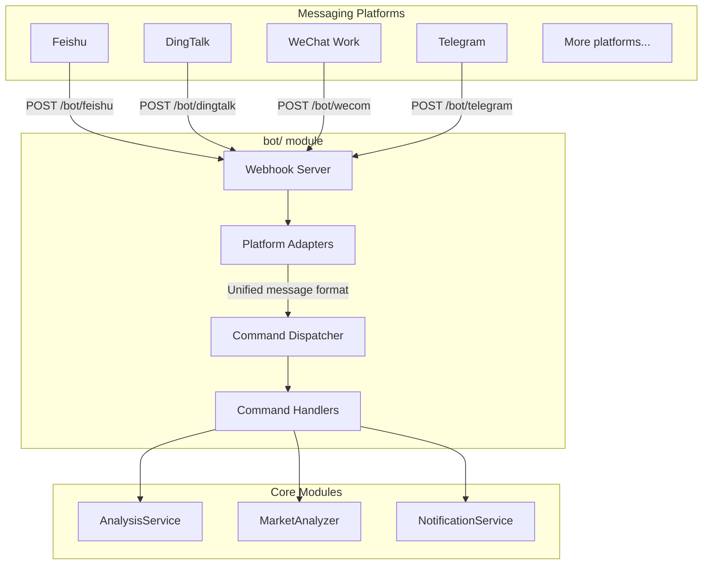

# Bot Integration Guide

This document covers the bot module architecture, supported commands, webhook routes, and how to configure platform integrations.

> **Glossary:** "Enterprise bot" in this context means a chatbot that receives commands via webhook from a messaging platform (Feishu / DingTalk / WeChat Work / Telegram) and calls the analysis pipeline to reply inline.

---

## 1. Architecture Overview



---

## 2. Directory Structure

```
bot/
├── __init__.py             # Module entry, exports main classes
├── models.py               # Unified message/response models
├── dispatcher.py           # Command dispatcher (core)
├── handler.py              # Webhook handler functions (one per platform)
├── commands/               # Command handlers
│   ├── __init__.py
│   ├── base.py             # Abstract base class for commands
│   ├── analyze.py          # /analyze — stock/index analysis
│   ├── ask.py              # /ask — single-turn question
│   ├── batch.py            # /batch — batch watchlist analysis
│   ├── chat.py             # /chat — multi-turn strategy chat
│   ├── market.py           # /market — market review
│   ├── help.py             # /help — help text
│   └── status.py           # /status — system status
└── platforms/              # Platform adapters
    ├── __init__.py
    ├── base.py             # Abstract base class for platforms
    ├── dingtalk.py         # DingTalk bot
    ├── dingtalk_stream.py  # DingTalk Stream bot
    └── feishu_stream.py    # Feishu (Lark) Stream bot
```

---

## 3. Core Abstractions

### 3.1 Unified Message Model (`bot/models.py`)

```python
@dataclass
class BotMessage:
    platform: str       # Platform ID: feishu / dingtalk / wecom / telegram
    user_id: str        # Sender ID
    user_name: str      # Sender display name
    chat_id: str        # Conversation ID (group or DM)
    chat_type: str      # Conversation type: group / private
    content: str        # Message text
    raw_data: Dict      # Raw request data (platform-specific)
    timestamp: datetime
    mentioned: bool = False  # Whether the bot was @-mentioned

@dataclass
class BotResponse:
    text: str
    markdown: bool = False  # Whether the response is Markdown
    at_user: bool = True    # Whether to @-mention the sender
```

### 3.2 Platform Adapter Base (`bot/platforms/base.py`)

```python
class BotPlatform(ABC):
    @property
    @abstractmethod
    def platform_name(self) -> str: ...

    @abstractmethod
    def verify_request(self, headers: Dict, body: bytes) -> bool:
        """Verify request signature (security check)"""
        ...

    @abstractmethod
    def parse_message(self, data: Dict) -> Optional[BotMessage]:
        """Parse platform message into unified format"""
        ...

    @abstractmethod
    def format_response(self, response: BotResponse, message: BotMessage) -> WebhookResponse:
        """Convert unified response to platform format"""
        ...
```

### 3.3 Command Base Class (`bot/commands/base.py`)

```python
class BotCommand(ABC):
    @property
    @abstractmethod
    def name(self) -> str: ...          # e.g. 'analyze'

    @property
    @abstractmethod
    def aliases(self) -> List[str]: ... # e.g. ['a', 'analyse']

    @property
    @abstractmethod
    def description(self) -> str: ...

    @property
    @abstractmethod
    def usage(self) -> str: ...

    @abstractmethod
    def execute(self, message: BotMessage, args: List[str]) -> BotResponse: ...
```

---

## 4. Supported Commands

| Command | Description | Example |
|---------|-------------|---------|
| `/analyze` | Analyze a specific stock or a registered index | `/analyze AAPL`, `/analyze 600519`, `/analyze sh000016`, `/analyze 上证50` |
| `/ask` | Single-turn question about a stock or the market | `/ask what is RSI for AAPL` |
| `/batch` | Batch-analyze your configured watchlist | `/batch` |
| `/chat` | Multi-turn strategy chat (maintains conversation context) | `/chat` |
| `/market` | Market review (A-shares / US stocks) | `/market` |
| `/help` | Show help text | `/help` |
| `/status` | Show system status | `/status` |

> **Stock code formats:** A-shares use 6-digit codes (e.g. `600519`); HK stocks prefix `hk` (e.g. `hk00700`); US stocks use ticker symbols (e.g. `AAPL`, `TSLA`).

> **Registered index inputs:** explicit codes (`sh000016`), CSI aliases (`930955.CSI` converges to `csi930955`) and registered Chinese names (`上证50`) are all accepted. Index inputs are submitted as a structured `AnalysisTarget` that flows through to the analysis pipeline, so `sh000016` is never rewritten to `SH000016`. Unregistered CSI forms (e.g. `930956.CSI`), code shapes the legacy gate rejected (`12345`, bare `00700`, `600519.SH`, unregistered `sh999999`) and unrecognized names return an explicit error without submitting a task; ambiguous registered names require an explicit code instead of guessing. Stock inputs (A-share 6-digit, `HK`+5-digit, US 1-5 letters, e.g. `usfd`→`USFD`) keep the legacy code path. Stock-name inputs (e.g. `贵州茅台`) are newly exposed by this Bot entry: they reuse the existing name resolver (`resolve_name_to_code`) and then submit the legacy code without a structured target.

### Bot index entry online E2E smoke (`scripts/smoke_bot_index_entry.py`)

Walks the real `CommandDispatcher.dispatch_async -> AnalyzeCommand -> TaskService -> StockAnalysisPipeline` online for a single target, covering the `SH.000016` / `上证50` / `930955.CSI` matrix scenarios without any webhook transport (no mocked online dependencies, no dry-run).

Run with a single target argument (`--timeout` defaults to 900 seconds):

```powershell
.venv\Scripts\python.exe scripts/smoke_bot_index_entry.py "SH.000016"
.venv\Scripts\python.exe scripts/smoke_bot_index_entry.py "上证50"
.venv\Scripts\python.exe scripts/smoke_bot_index_entry.py "930955.CSI"
```

Process responsibilities: a worker subprocess submits and polls the in-process `TaskService` and prints single-line `E2E_EVENT {json}` events (`phase=submitted|completed|failed|timeout`, with `target`, plus `task_id`/`stock_code`/`result`/`error` per phase); the parent only enforces the deadline, cleans up the process tree and maps exit codes (0=success / 1=failure / 124=timeout).

Failure semantics: a failed task or a completed-but-incomplete result (canonical code or registered name not matching the matrix expectation, or any of `analysis_summary`/`operation_advice`/`trend_prediction` empty or whitespace-only) emits a `failed` event and exits non-zero; on timeout the process tree is killed (Windows `taskkill /T /F`, POSIX process group) — a successful cleanup emits a `timeout` event and exits 124, a failed cleanup emits a `failed` event carrying the cleanup error and exits 1 — never rolling back DB / reports / notifications side effects. On a user Ctrl-C the parent also cleans up the process tree first: a successful cleanup propagates the interrupt, a failed cleanup emits a `failed` event carrying the cleanup error and exits 1 — a cleanup failure is never silently swallowed. The worker's expected code/name come from the script's built-in authoritative matrix map (`SH.000016`/`上证50` → `sh000016`/`上证50`, `930955.CSI` → `csi930955`/`红利低波100`) — never from the response or the result's self-reported identity: a submission whose `extra.stock_code` does not match the expectation fails with an explicit mismatch error carrying the expected and actual values (the failed event also carries the structured actual `stock_code`), and targets outside the matrix as well as non-positive `--timeout` are rejected before any submission or subprocess spawn (argument/input error, exit code 2). Unexpected worker exceptions (dispatch / poll / event serialization) emit a `failed` event and exit 1 with the exception evidence kept on stderr; `KeyboardInterrupt` is not treated as an ordinary failure; the parent normalizes any other worker exit code to 1 so the runtime contract only exposes 0 / 1 / 124. The parent spawns the worker with an internal `--worker` flag, not via environment variables.

Prerequisites: network plus configured data-source and AI credentials (online chain). This script is not part of the offline gate and does not run in CI.

---

## 5. `/status` and LLM configuration diagnostics

### Configuration precedence for readiness in `/status`

- The AI availability displayed by `/status` follows runtime precedence:
  - `LITELLM_CONFIG` (LiteLLM YAML)
  - `LLM_CHANNELS`
  - legacy provider keys (`GEMINI_API_KEY` / `OPENAI_API_KEY` / `ANTHROPIC_API_KEY` / `DEEPSEEK_API_KEY`)
- If the primary model (`LITELLM_MODEL` or `AGENT_LITELLM_MODEL`) has no configured source in the active layer, `/status` shows `AI 服务未配置` and keeps the explicit reason line.
- Runtime dependency constraint in this repository is `litellm>=1.80.10,!=1.82.7,!=1.82.8,<1.99.0`; current status semantics are aligned with this constraint.
- This diagnostic follows the same readiness rules as `GET /api/v1/system/config/setup/status` for LLM checks: channels/yaml are active higher priority than legacy keys, and no silent migration is performed when toggling modes.

### Fallback and migration boundary

- When `LITELLM_CONFIG` or `LLM_CHANNELS` is active, lower-priority legacy provider keys are ignored as the active source for that run (no silent downgrade).
- This change only improves diagnosis and does not perform automatic migration: legacy configuration values are not deleted or rewritten during startup or status collection.

### Official compatibility references (for triage)

- LiteLLM docs: https://docs.litellm.ai/
- LiteLLM OpenAI-compatible provider: https://docs.litellm.ai/docs/providers/openai_compatible
- OpenAI Chat API: https://platform.openai.com/docs/api-reference/chat
- DeepSeek API docs: https://api-docs.deepseek.com/
- Kimi Moonshot compatibility: https://platform.moonshot.ai/docs/guide/compatibility
- Gemini OpenAI compatibility: https://ai.google.dev/gemini-api/docs/openai
- Ollama API docs: https://github.com/ollama/ollama/blob/main/docs/api.md

## 6. Webhook Routes

Handler functions for each platform live in `bot/handler.py`.
These routes are **not yet wired** into the FastAPI application — you must mount them manually.

| Route | Method | Status | Notes |
|-------|--------|--------|-------|
| `/bot/dingtalk` | POST | **Ready** | `DingtalkPlatform` is registered in `ALL_PLATFORMS` |
| `/bot/feishu` | POST | Stream only | Use `feishu_stream.py`; no Webhook adapter in `ALL_PLATFORMS` |
| `/bot/wecom` | POST | Not implemented | Handler exists but no platform adapter |
| `/bot/telegram` | POST | Not implemented | Handler exists but no platform adapter |

To mount the DingTalk webhook in your FastAPI app:

```python
from bot.handler import handle_dingtalk_webhook

@app.post("/bot/dingtalk")
async def dingtalk_webhook(request: Request):
    headers = dict(request.headers)
    body = await request.body()
    return handle_dingtalk_webhook(headers, body)
```

---

## 7. Configuration

Add the following to your `.env`. Some of these bot-specific keys are already listed in `.env.example` (for example the DingTalk and Feishu app credentials), while others are not, so treat this section as a consolidated reference for bot setup:

```dotenv
# --- Bot general ---
BOT_ENABLED=false
BOT_COMMAND_PREFIX=/

# --- Feishu (Lark) bot ---
FEISHU_APP_ID=
FEISHU_APP_SECRET=
FEISHU_DOMAIN=feishu             # feishu (China) or lark (international/Lark)
FEISHU_VERIFICATION_TOKEN=    # Event verification token
FEISHU_ENCRYPT_KEY=           # Encryption key (optional)

# --- DingTalk bot ---
DINGTALK_APP_KEY=
DINGTALK_APP_SECRET=

# --- WeChat Work bot (in development) ---
WECOM_TOKEN=
WECOM_ENCODING_AES_KEY=

# --- Telegram bot ---
TELEGRAM_BOT_TOKEN=           # Get from @BotFather
TELEGRAM_WEBHOOK_SECRET=      # Webhook secret token
```

---

## 7. Extending the Bot

### Adding a new platform adapter

1. Create a new file in `bot/platforms/`.
2. Subclass `BotPlatform` and implement `verify_request`, `parse_message`, `format_response`.
3. Mount the webhook route directly in your FastAPI app (for example in `api/app.py`) instead of `api/v1/router.py`, so the callback path stays `/bot/<platform>` rather than `/api/v1/bot/<platform>`.

### Adding a new command

1. Create a new file in `bot/commands/`.
2. Subclass `BotCommand` and implement the `execute` method.
3. Register the command in the dispatcher startup code.
