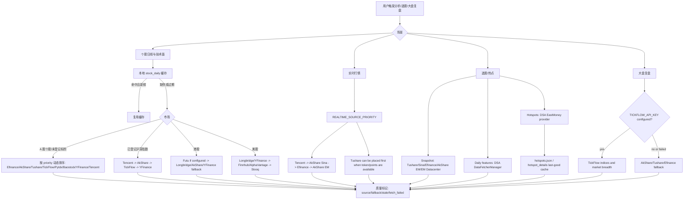
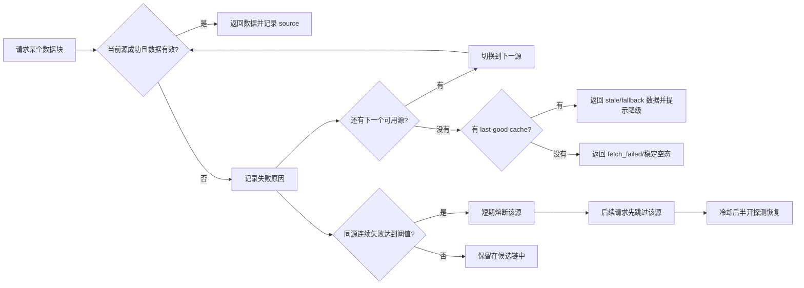
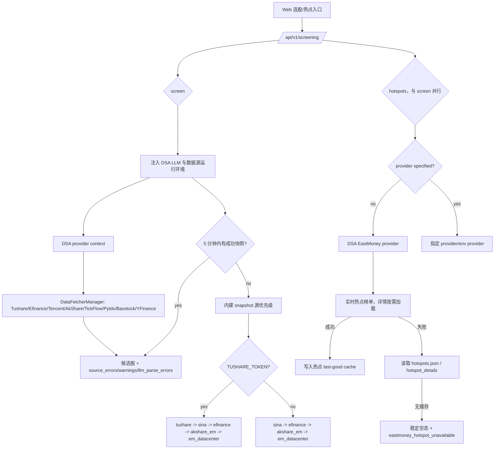

# 数据源稳定性与故障处理图示

本文面向用户、部署者和维护者，说明 DSA 已接入的数据源如何参与分析、选股和大盘复盘，以及当数据源失败时系统会怎么降级。

核心原则：先用项目已经接入并验证过的数据源，把失败路径讲清楚；新增外部数据源应放在第二阶段，避免先扩大维护面。

## 一句话答复用户

如果遇到“数据源失败”，通常不是系统只能用一个源，而是免费源被限流、上游接口临时变更、网络抖动或当前市场/标的不支持。DSA 已经内置多数据源 fallback，会按场景自动尝试下一个源；如果你希望更稳定，建议至少配置一个 token 型稳定源：

- A 股个股与选股：优先配置 `TUSHARE_TOKEN`，并保留 AkShare / Efinance / Tencent / TickFlow / Baostock / YFinance 兜底；普通个股日线按 priority 配置排序。
- 已登记 A 股指数：固定按 Tencent → AkShare → TickFlow → YFinance 降级，不读取普通日 K 的 `*_PRIORITY` 配置。
- A 股大盘复盘：配置 `TICKFLOW_API_KEY` 后，复盘聚合所需的指数和市场宽度会优先尝试 TickFlow，失败后回退现有免费源；这与单标的指数日线的 Tencent-first 固定链是不同入口。
- 港股：配置 `FUTU_OPEND_HOST` 后，Futu 可作为港股实时与基本面主源；`FUTU_HK_REALTIME_SOURCE_PRIORITY` 控制港股实时行情顺序，Longbridge、AkShare、YFinance 保留为 fallback。
- 美股：配置 `LONGBRIDGE_*` 后可优先使用 Longbridge，YFinance 保留实时主链 fallback；Finnhub、AlphaVantage 只在已有主源报价后补充字段或参与日线链，不能在 Longbridge/YFinance 全部失败时独立返回实时报价。
- 热点题材：选股的热点实现参考 AlphaSift，默认走 EastMoney provider，并使用本地 last-good cache 降低实时接口失败影响。

## 已接入数据源矩阵

| 场景 | 已接入源 | 默认使用方式 | 失败处理 |
| --- | --- | --- | --- |
| A 股个股日线 / 技术面 | Efinance、Tencent、AkShare、Tushare、TickFlow、Pytdx、Baostock、YFinance | `DataFetcherManager` 按 priority 尝试；配置 `TUSHARE_TOKEN` 后 Tushare 自动进入候选源 | 单源失败后尝试下一个源；连续失败会短期熔断该源 |
| 已登记 A 股指数日线 / 技术面 | Tencent、AkShare、TickFlow、YFinance | 当前 5 个 `IndexRegistry` 标的固定按 Tencent → AkShare → TickFlow → YFinance 尝试，不读取普通日 K 的 `*_PRIORITY` 配置 | 未配置、熔断、异常或空结果均继续下一源；全部失败返回空结果并记录汇总告警 |
| A 股实时行情 | Tencent、AkShare Sina、Efinance、AkShare EM、Tushare | `REALTIME_SOURCE_PRIORITY` 控制顺序，默认偏向 Tencent / Sina 这类轻量源 | 失败源记录 `fallback_from`，成功源继续返回 |
| A 股大盘复盘 | TickFlow、AkShare、Tushare、Efinance | 配置 `TICKFLOW_API_KEY` 后，复盘聚合的主指数和市场宽度优先尝试 TickFlow；不等同于单标的指数日线链 | TickFlow 权限不足或失败时回退 AkShare / Tushare / Efinance 链路 |
| 选股快照 | Tushare、Sina、Efinance、AkShare EM、EastMoney Datacenter | 有 `TUSHARE_TOKEN` 时自动把 `tushare` 放入快照优先级；否则使用免费源链路 | 选股引擎维护 source health；状态接口透出 snapshot/daily health |
| 选股日线补特征 | `DataFetcherManager` | 选股引擎优先复用现有日线与缓存链路 | 现有链路失败后才回到引擎自身的日线源 |
| 选股热点题材 | EastMoney provider、参考 AlphaSift 的 hotspot 实现、last-good cache | 未指定 provider 时默认使用 EastMoney provider | 实时失败时回退热点缓存；无缓存时返回稳定空态和可读错误 |
| 港股 | Futu、Longbridge、YFinance、AkShare、Tushare | 配置 `FUTU_OPEND_HOST` 后 Futu 作为实时与基本面主源，按 `FUTU_HK_REALTIME_SOURCE_PRIORITY` 顺序尝试 | Futu 失败时回退 Longbridge / AkShare / YFinance；Longbridge 冷却或失败时继续回退 YFinance / 其他可用源 |
| 美股 | Longbridge、YFinance、AkShare、Tushare、Finnhub、AlphaVantage、Stooq | 配置 Longbridge 凭证后参与美股日线/实时主链；YFinance 保持实时基础 fallback；Finnhub/AlphaVantage 可补充已有报价字段并参与日线链 | Longbridge 冷却或失败时实时主链回退 YFinance；两者都失败时不把补充源伪装成可独立返回报价的 fallback |

## 统一数据能力只读契约

Web/API 提供 `GET /api/v1/data/overview` 和等价别名 `GET /api/v1/data/capabilities`，用于把数据源能力、数据集质量和场景优先级以同一个只读结构暴露给首页看板、数据中心、个股详情、自选和选股页面。

首版契约只读取配置和 `DataFetcherManager` 的 fetcher 快照，不触发外部行情请求，也不返回任何原始密钥。响应分三层：

- `providers`：每个 provider 的 `enabled`、`configured`、`status`、`markets`、`datasets`、精确的 `dataset_markets` 和非敏感 warning。`markets` 与 `datasets` 只是聚合索引，不能推断为笛卡尔积；例如 YFinance 可参与 A 股行情，但 A 股基本面固定走 AkShare，因此 `dataset_markets.financial.snapshot` 不包含 `cn`。Finnhub/AlphaVantage 的美股报价 handler 当前只在 Longbridge/YFinance 已返回主报价后补字段，因此不声明 `quote.realtime` 独立路由能力。
- `datasets`：`quote.realtime`、`kline.daily`、`index.daily`、`market.overview`、`financial.snapshot`、`news.events`、`strategy.screening`、`alert.monitor`、`portfolio.account` 的 `status/source/fallback_from/stale/warnings`；其中 `quote.realtime`、`kline.daily`、`market.overview` 和 `financial.snapshot` 都聚合市场级 coverage，避免把单市场健康度误报成全局可用。A 股实时额外拆分 `cn` 股票优先级、`cn.index.exchange` 固定指数链和 `cn.index.csi` Efinance-only 链；美股实时拆分 `us` 个股动态优先级与 `us.index` 固定 YFinance-only 链。AkShare Tencent/Sina/EM、AkShare HK 双子源、Efinance 股票/指数子源级熔断及日线 breaker 会先于 provider-wide unknown 判定，使 overview 与运行时跳过行为一致。YFinance 的港股实时声明对应其实际 `.HK` 执行路径；未配置 OpenD 时 HK priority 与运行时一致地跳过 Futu；美股个股实时也按当前请求可用性跳过处于连接冷却的 Longbridge，使 YFinance 成为实际主源而不是伪 fallback。PyTDX 不声明未接入统一 route 的实时能力，YFinance 指数日线只声明实际可执行的 CN/US route。任何按运行时顺序尝试的数据集在首个优先源尚未探测且没有更具体的 open breaker 证据时保持 `unknown`，不会越过它宣称后续源已被选中。`alert.monitor` 只有在开关启用且当前 API 进程的 scheduler 已实际注册并运行 `agent_event_monitor` 时才为 `ok`；开关关闭返回 `agent_event_monitor_disabled`，scheduler 未运行则返回 `agent_event_monitor_not_running`。
- `priorities`：`cn.realtime`、`hk.realtime`、`us.realtime`、`daily.generic`、`cn.index.daily`、`market.overview`、`screening.snapshot`、`news.events` 的当前 source order；`daily.generic` 与运行时一样先排除当前请求不可用或处于连接冷却的 fetcher，不把已跳过的数据源记录成 fallback。
- `index.daily` 额外区分 `cn.exchange`、`cn.csi` 与 `us` coverage：沪深交易所指数使用 Tencent、AkShare、TickFlow、YFinance 固定多源链，CSI 指数按运行时契约只认 AkShare，美股指数只声明当前能够接收指数 symbol 的 YFinance；Finnhub 当前 fetcher 会拒绝指数 symbol，因此不作为伪 fallback。Tushare 不声明指数日线能力。CN/HK realtime 都只接受对应运行时实际有 handler 的 source token，Tushare realtime 能力仅声明 A 股。

其中 `unknown` 表示尚未执行运行态探测，`unconfigured` 表示缺少必要配置，`degraded` 表示前置优先源不可用但后续源仍可消费。选股 source health 在冷启动、成功数和失败数都为 0 时保持 `unknown`，不会把尚未调用的数据源提前标成 `ok`。后续 Data Center 可以在同一结构上追加 last_success、coverage、cooldown 和运行历史，不需要各页面各自维护数据质量口径。

## 总体链路图



## 失败与降级图



当前日线源熔断策略为连续失败 3 次后短期冷却约 5 分钟。它的目的不是永久禁用数据源，而是避免一个短时间不可用的源拖慢整批分析。

## 选股与热点链路



## 推荐配置档

### 免费模式

适合个人试用，依赖免费源自动 fallback。优点是不需要 token；缺点是更容易遇到上游限流或临时接口变化。

```env
REALTIME_SOURCE_PRIORITY=tencent,akshare_sina,efinance,akshare_em
ENABLE_EASTMONEY_PATCH=true
```

### A 股稳定模式

适合经常跑选股、批量分析或对外服务。Tushare 用于增强普通 A 股日线与快照稳定性；TickFlow 可增强普通 A 股日 K、已登记指数固定 fallback、实时行情和大盘复盘（实时行情需显式加入 `REALTIME_SOURCE_PRIORITY`）；免费源继续作为兜底。

```env
TUSHARE_TOKEN=your_tushare_token
TICKFLOW_API_KEY=your_tickflow_key

REALTIME_SOURCE_PRIORITY=tickflow,tushare,tencent,akshare_sina,efinance,akshare_em
SNAPSHOT_SOURCE_PRIORITY=tushare,sina,efinance,akshare_em,em_datacenter

# 选股运行期默认值；显式配置时会保留你的值
DAILY_FETCH_RETRIES=3
DAILY_FETCH_MAX_WORKERS=1
```

注意：TickFlow 能力按套餐权限分层；权限不足或请求失败时会 fail-open 回退到现有免费源，不建议把它当成所有市场行情的唯一来源。

### 港股 / 美股稳定模式

适合港美股组合、持仓和个股分析。Longbridge 配置后优先参与港美股链路；YFinance、Finnhub、AlphaVantage 作为兜底。

```env
LONGBRIDGE_OAUTH_CLIENT_ID=your_client_id
LONGBRIDGE_OAUTH_TOKEN_CACHE_B64=your_token_cache_base64

FINNHUB_API_KEY=your_finnhub_key
ALPHAVANTAGE_API_KEY=your_alphavantage_key
```

如果仍使用 Legacy Longbridge 凭证，也可以继续配置：

```env
LONGBRIDGE_APP_KEY=your_app_key
LONGBRIDGE_APP_SECRET=your_app_secret
LONGBRIDGE_ACCESS_TOKEN=your_access_token
```

## 用户可见提示建议

对外沟通时建议区分三类情况：

| 情况 | 建议提示 |
| --- | --- |
| 单个源失败但 fallback 成功 | 本次使用了降级数据源，分析仍可继续；报告中会标记实际成功源。 |
| 多个源失败但有缓存 | 实时源不可用，本次使用上一次成功缓存；结论会降低置信度。 |
| 全部源失败且无缓存 | 当前数据不可用，请稍后重试。普通 A 股可检查 Tushare/TickFlow；已登记指数应检查 Tencent/AkShare 连通性或配置 TickFlow；港美股可检查 Longbridge。 |

普通 A 股日线使用 `cn` 健康度命名空间，已登记指数固定链使用独立的 `cn_index` 命名空间；任一链的连续失败不会熔断另一条链。指数源返回空结果时会继续 fallback 并记录诊断，四源全部失败则返回空结果和空来源；普通股票保留既有最终异常语义。

### 新闻面证据缺失的报告标注（已实现）

报告会区分新闻检索**未执行**和**执行后零命中**，分别渲染对应提示：

> ⚠️ 未配置搜索渠道，本次分析未纳入新闻面证据。

> ⚠️ 本次未获取到可用的新闻面数据，以下结论未纳入新闻维度证据。

覆盖 dashboard、brief、个股与日报四个渲染路径，以及历史 Markdown、分享图片和 Web
报告详情；中文、英文、韩文报告使用各自的披露文案。该提示的判定独立于模型输出：
即使 LLM 按 schema 写出了 `market_sentiment` / `hot_topics`，只要检索零命中就照常提示，
避免出现「展示模型生成的情绪判断、却隐瞒无新闻证据」这一组合。

判定依据是 `AnalysisResult.news_result_count`：

| 取值 | 含义 | 是否提示 |
| --- | --- | --- |
| `None` | 未执行检索（未配置搜索渠道） | **是**——明确说明本次分析没有新闻面证据 |
| `0` | 执行了检索但零命中（搜索源限流、全部失败等） | **是** |
| `> 0` | 正常拿到新闻 | 否 |

新记录会把该三态值随分析结果持久化，保证实时报告和历史报告一致。旧记录若没有保存
`news_result_count`，其新闻检索状态只能视为未知，历史展示保持原样，不会倒推为“未配置搜索渠道”。

## 后续可做的产品化增强

1. 数据源 Doctor 页面：展示每个源最近成功时间、失败原因、熔断状态和下一次恢复探测时间。
2. 一键推荐配置：根据市场选择生成 `.env` 片段，例如“A 股稳定模式”“港美股稳定模式”“免费模式”。
3. 选股状态面板：直接展示 snapshot/daily source health，让用户知道是 Sina、Efinance、AkShare 还是 Tushare 出问题。
4. 批量任务限速策略：对免费源自动降低并发，优先复用本地日线缓存，减少触发上游限流。
5. 可选商业源接入：只有在现有 Tushare / TickFlow / Longbridge / Finnhub / AlphaVantage 仍不能覆盖需求时，再考虑新增 Twelve Data、Massive/Polygon、Nasdaq Data Link 等源。

## 官方资料

- Tushare: https://tushare.pro/document/2
- TickFlow: https://tickflow.org/
- AkShare: https://akshare.akfamily.xyz/
- Longbridge OpenAPI: https://open.longportapp.com/
- Finnhub API: https://finnhub.io/docs/api
- Alpha Vantage API: https://www.alphavantage.co/documentation/
